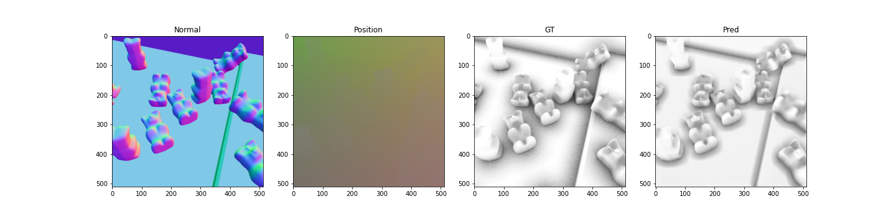
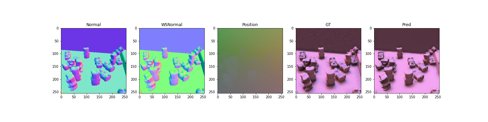
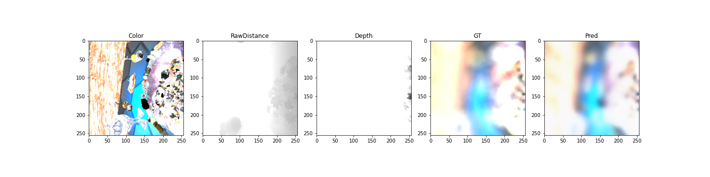
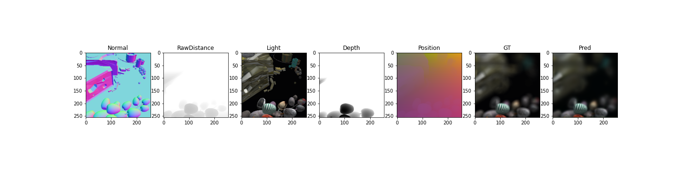
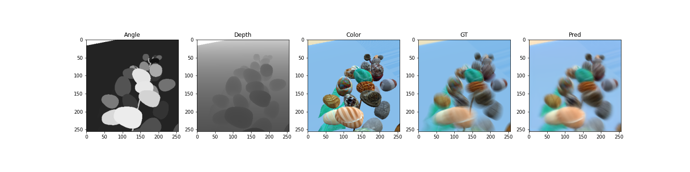

## Deep Shading: Convolutional Neural Networks for Screen Space Shading

This repository is a replication of the following paper [ Deep Shading: Convolutional Neural Networks for Screen Space Shading](https://arxiv.org/abs/1603.06078) 

_Oliver Nalbach, Elena Arabadzhiyska, Dushyant Mehta, Hans-Peter Seidel, Tobias Ritschel Deep Shading: Convolutional Neural Networks for Screen-Space Shading to appear in Proc. EGSR 2017_

For the SSIM loss, this implementation is used: https://github.com/jorge-pessoa/pytorch-msssim. Each experiment is in the form of a Jupyter Notebook.

## Abstract

In computer vision, convolutional neural networks (CNNs) achieve unprecedented performance for inverse problems where RGB pixel appearance is mapped to attributes such as positions, normals or reflectance. In computer graphics, screen space shading has boosted the quality of real-time rendering, converting the same kind of attributes of a virtual scene back to appearance, enabling effects like ambient occlusion, indirect light, scattering and many more. In this paper we consider the diagonal problem: synthesizing appearance from given per-pixel attributes using a CNN. The resulting Deep Shading renders screen space effects at competitive quality and speed while not being programmed by human experts but learned from example images.

### Models

You can access the trained models here: [Google Drive](https://drive.google.com/drive/folders/1fuwAUQBujGfeY4sDrL0ly0_bL_zbXdov?usp=sharing)

|           | AO     | DO     | DoF    | AO + DoF | MB     |
|-----------|--------|--------|--------|----------|--------|
| Test SSIM | 0.9215 | 0.9096 | 0.9567 | 0.9564   | 0.9715 |

* **AO:** Ambient Occlusion
* **DO:** Directional Occlusion
* **DoF:** Depth of Field
* **AO + DoF:** Ambient Occlusion + Depth of Field
* **MB:** Motion Blur

### Dataset

The dataset was available (700GB) during the implementation, however the authors decided to restrict access. Here we have some visualizations:

#### AO

#### DO

#### DoF

#### AO + DoF

#### MB

### Requirements

I haven't exported a **requirements.txt** file, but the following setup should be sufficient:

* PyTorch 1.6.0
* PIL  
* Matplotlib
* pyexr